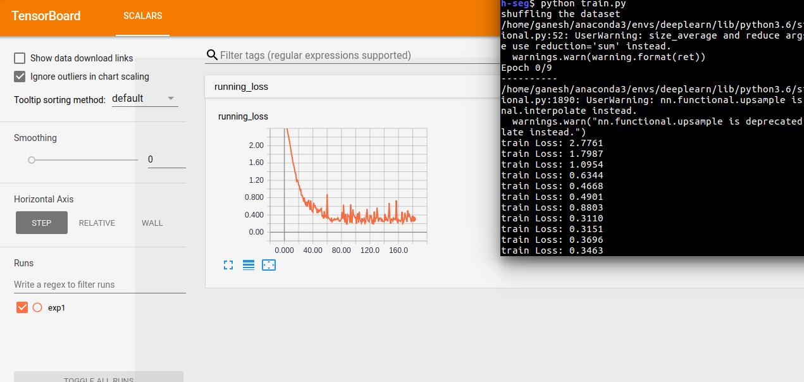
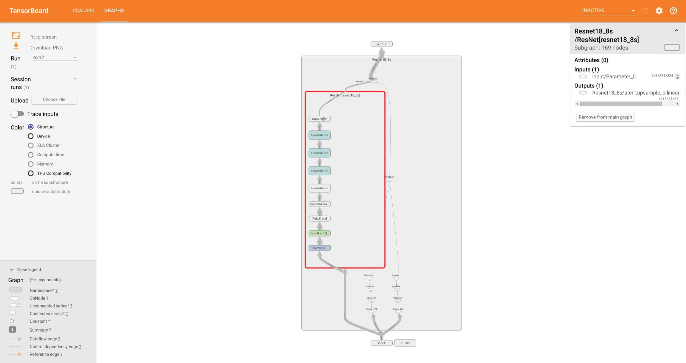
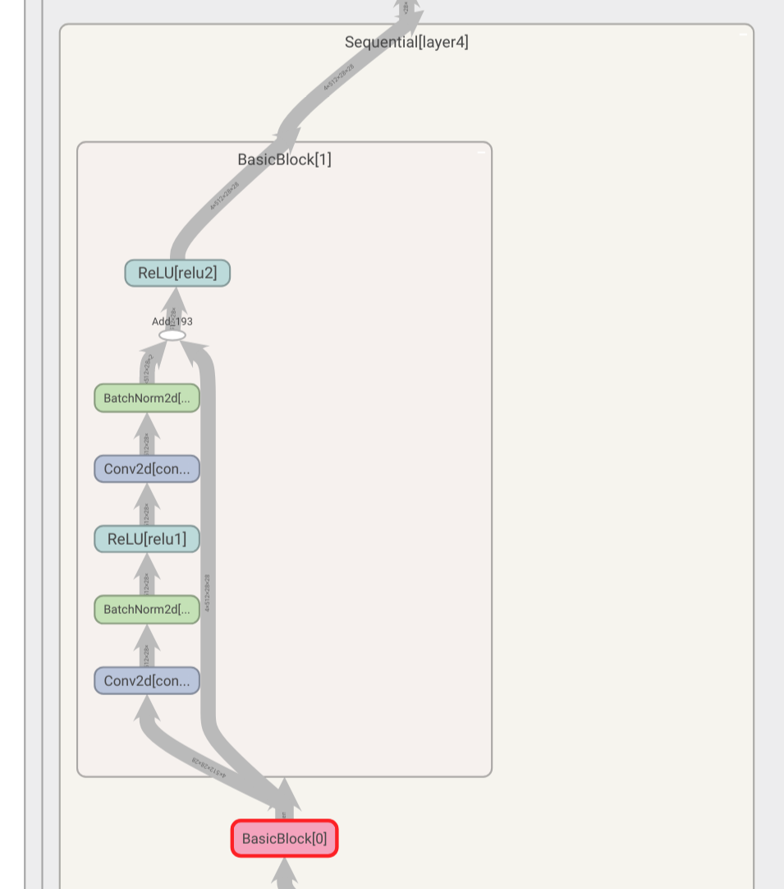

# mini-pytorch-examples

## How to Train Model
Download data:
```
$ cd pytorch-cls
$ wget https://download.pytorch.org/tutorial/hymenoptera_data.zip
```
```
$ cd pytorch-seg/data
$ wget http://www.doc.ic.ac.uk/~ahanda/nyu_test_rgb.tgz
$ wget http://www.doc.ic.ac.uk/~ahanda/nyu_train_rgb.tgz
$ wget https://github.com/ankurhanda/nyuv2-meta-data/raw/master/test_labels_13/nyuv2_test_class13.tgz
$ wget https://github.com/ankurhanda/nyuv2-meta-data/raw/master/train_labels_13/nyuv2_train_class13.tgz
```
Run the training script:
```
$ python3 train.py
```
Here's an example of how to pass in various arguments are provided in the script `pytorch-seg/train-model-exp1.sh`:
```
# pytorch-seg/train-model-exp1.sh

python train.py \
--dataroot "/media/shrek/work/datasets/shuran-mini-pytorch-examples/" \
--file_list "./data/datalist" \
--batchSize 4 \
--shuffle True \
--phase train \
--num_epochs 10 \
--imsize 224 \
--logs_path "logs/exp3"
```

The checkpoints will be stored in the `pytorch-seg/checkpoints` folder.

## How to Visualize the data via Tensorboard

Support has been added for visualizing data through Tensorboard via the pytorch package [TensorBoardX](https://github.com/lanpa/tensorboardX).

Install TensorBoardX:
```
$ pip install git+https://github.com/lanpa/tensorboardX
```

While the model is training, run:
```
$ tensorboard --logdir pytorch-seg/logs
```

### Viewing model graph
You can also view a graph of the model. Note that bilinear upsampling is not yet supported:



## Changelog
#### v1.1
- Added tensorboard visualization
- Cleaned up some deprecated bilinear upsampling functions
- Added documentation

#### v1.0
- Added code